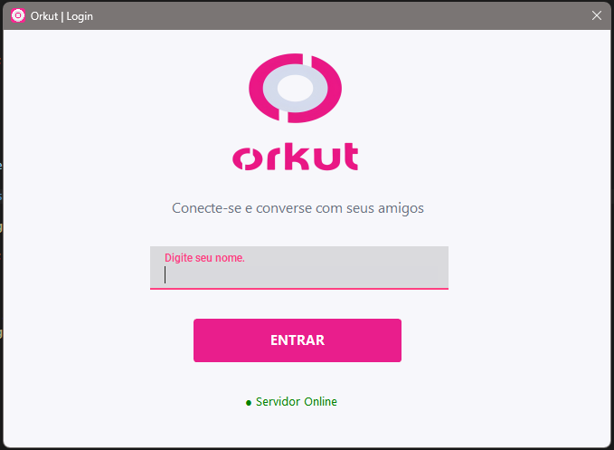
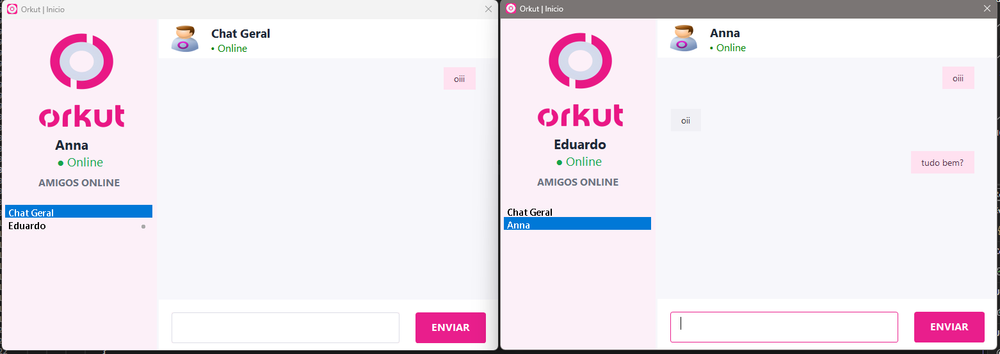

# 💬 Chat Cliente

Aplicação de chat multiusuário desenvolvida em **C# com Windows Forms**, utilizando **Sockets UDP** para comunicação através de um servidor central.

O projeto foi desenvolvido como parte de um desafio acadêmico e possui uma identidade visual inspirada no **Orkut**, trazendo uma releitura mais moderna da clássica rede social.

A aplicação combina essa proposta visual com funcionalidades atuais de mensageria, permitindo **conversas privadas, Chat Geral, usuários online e offline, notificações e reconexão automática ao servidor**.

---

## 📸 Interface

### Login
<p align="center">
  
</p>

### Conversa Privada e Geral
<p align="center">
  
</p>

---

## ✨ Funcionalidades

- Login por nome de usuário
- Validação de nomes duplicados
- Múltiplos usuários conectados
- Conversas privadas
- Chat Geral
- Histórico separado por conversa
- Usuários online e offline
- Notificações de mensagens não lidas
- Bloqueio de mensagens para usuários offline
- Detecção de queda do servidor
- Reconexão automática
- Preservação das conversas durante reconexões

---

## 🛠️ Tecnologias

- C#
- .NET
- Windows Forms
- UDP
- Sockets
- Threads
- Git e GitHub

---

## 🏗️ Arquitetura

A comunicação utiliza um servidor central responsável por receber e encaminhar as mensagens entre os clientes.

```text
ChatCliente
     │
     │ UDP
     ▼
ChatServidor
 Porta 9060
     ▲
     │ UDP
     │
ChatCliente
```

---

## ▶️ Como executar

1. Inicie o **ChatServidor**.
2. Configure no ChatCliente o IP da máquina onde o servidor está sendo executado.
3. Execute o **ChatCliente**.
4. Digite um nome disponível.
5. Abra outros clientes para iniciar as conversas.

> O servidor utiliza a porta `9060`.

---

## 🚀 Próxima etapa

A versão atual funciona através de **UDP em rede local**.

A próxima fase do projeto será adaptar a comunicação para funcionar através da internet utilizando **ASP.NET Core e SignalR**.

---

## 👩‍💻 Desenvolvedores

**Ana Beatriz**  
**Eduardo Paiva**

Projeto acadêmico desenvolvido em C# utilizando arquitetura Cliente/Servidor.
